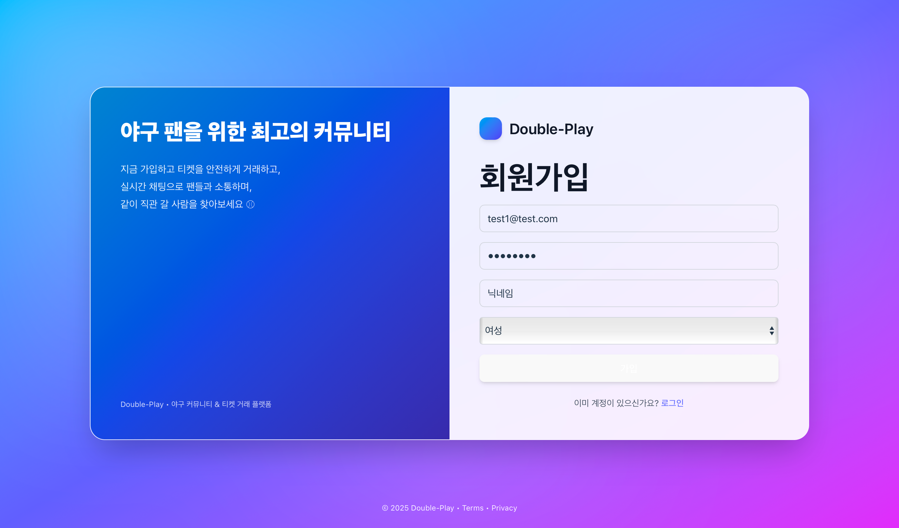

# ⚾ Double-Play
### 야구 팬들을 위한 **실시간 채팅 & 티켓 거래 플랫폼**

---

## 🚀 프로젝트 소개

  

Double-Play는 **야구 팬들이 모임을 만들고, 함께 채팅하며, 티켓을 안전하게 거래할 수 있는 커뮤니티 플랫폼**입니다.  
STOMP 기반 WebSocket을 활용해 **실시간 단체/1:1 채팅**을 지원하며, Spring Boot + React 기반 풀스택 프로젝트로 개발했습니다.

---

## 🛠 기술 스택

### Backend

### Frontend

### Database

---

## 📌 핵심 기능

### 🔑 회원가입 / 로그인

|  |  |
|-----------------------|-----------------------|

- 로컬 회원가입 및 JWT 기반 로그인
- Refresh Token을 HttpOnly Cookie로 관리
- 역할(Role)별로 접근 권한을 차등 적용합니다

### 💬 실시간 채팅

방 만들기를 통해 실시간 채팅방 생성이 가능합니다.

WebSocket + STOMP 기반 메시지 송수신 기능입니다
채팅 내용은 DB에 저장되어 새로고침 후에도 대화가 유지됩니다

 

- 사용자 요청 -> 방장 수락 -> 채팅 가능
- 사용자 요청 시 권한이 부여됩니다

|  |  |
|-----------------------|-----------------------|

 

### 🎟 티켓 거래 (1:1 채팅)

판매자는 티켓 정보를 입력하여 거래 등록이 가능합니다.

|  |  |
|------------------------|------------------------|

- 구매 버튼을 클릭하면 판매자와 1:1 채팅방이 생성되고, 티켓 거래 완료 시 채팅방이 닫히며 접근이 불가합니다.

### 📅 경기 조회
|  |  |
|------------------------|------------------------|

- 야구 경기 일정 및 구장별 경기 정보 조회가 가능합니다.

 

---

 
 

### 🚀 향후 개선 계획

- **CI/CD 배포 자동화**  
  Docker + GitHub Actions를 활용한 클라우드 환경 배포

- **신고 기능**  
  부적절한 메시지 및 사용자 신고 → 관리자 검토 및 제재 처리

- **알림 시스템**  
  새로운 메시지, 참여 요청 발생 시 실시간 알림 제공

- **모바일 최적화**  
  다양한 기기에서의 가독성 및 사용성 개선
